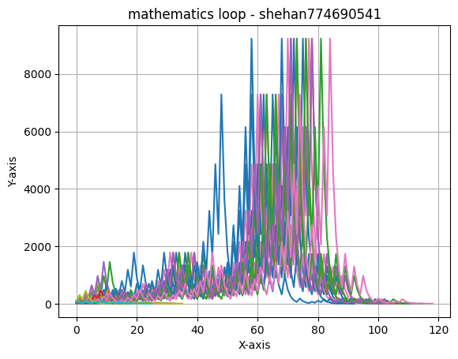

# Micro-mysteries-plot


The Collatz Conjecture, also known as the 3x + 1 problem or Collatz problem, is an unsolved mathematical problem that deals with a simple iterative sequence applied to positive integers.

The conjecture is defined as follows:

1. Start with any positive integer \( n \).
2. If \( n \) is even, divide it by 2 ( \( n / 2 \) ).
3. If \( n \) is odd, multiply it by 3 and add 1 ( \( 3n + 1 \) ).
4. Repeat this process with the resulting number, producing a new number, and continue the iterations.

The conjecture states that no matter what positive integer \( n \) you start with, the sequence of numbers generated will eventually reach 1. And once the sequence reaches 1, it will continue in the cycle \( 4, 2, 1 \).

For example, let's take the number 6:

- \( 6 \) is even, so \( 6 / 2 = 3 \).
- \( 3 \) is odd, so \( 3 \times 3 + 1 = 10 \).
- \( 10 \) is even, so \( 10 / 2 = 5 \).
- \( 5 \) is odd, so \( 5 \times 3 + 1 = 16 \).
- \( 16 \) is even, so \( 16 / 2 = 8 \).
- \( 8 \) is even, so \( 8 / 2 = 4 \).
- \( 4 \) is even, so \( 4 / 2 = 2 \).
- \( 2 \) is even, so \( 2 / 2 = 1 \).

The sequence generated for \( n = 6 \) eventually reaches 1, and it enters the cycle \( 4, 2, 1 \). The Collatz Conjecture posits that this will happen for any positive integer \( n \) you start with.

Despite extensive computer simulations verifying this conjecture for incredibly large numbers, a proof confirming that this sequence always reaches 1 for any positive integer \( n \) has not been discovered. The simplicity of the problem combined with its unresolved nature makes the Collatz Conjecture an intriguing and unsolved problem in mathematics.


<center>  </center>


<hr />

### create new environment 
<code> python -m venv venv </code>

### load environment
<code> Set-ExecutionPolicy -Scope Process -ExecutionPolicy Bypass </code> <br>
<code> .\venv\Scripts\Activate.ps1 </code>

### install module
<code>pip install matplotlib</code>


<hr />

### Basic Structure

```
  def collatz_sequence(n):
      sequence = [n]

      while n != 1:
          if n % 2 == 0:
              n //= 2
          else:
              n = 3 * n + 1
          sequence.append(n)

      return sequence

  def display_collatz_sequence(n):
      sequence = collatz_sequence(n)
      print(sequence)

  starting_number = 3
  display_collatz_sequence(starting_number)
```

The code defines two functions: collatz_sequence and display_collatz_sequence.

~ collatz_sequence(n) Function:

This function generates a Collatz sequence starting from a given positive integer n.
It initializes a list sequence with the initial value n.
It enters a while loop that continues until n becomes 1.
Inside the loop, if n is even, it divides n by 2 (n //= 2), and if n is odd, it multiplies n by 3 and adds 1 (n = 3 * n + 1).
The resulting value of n at each iteration is appended to the sequence list.
Finally, the function returns the generated sequence.


~ display_collatz_sequence(n) Function:

This function takes a starting number n and displays the Collatz sequence generated by calling the collatz_sequence function.
It calls the collatz_sequence function with the given n, obtains the sequence, and prints it.
Explanation of code execution with an example:

If you call display_collatz_sequence(3), it will print the Collatz sequence starting from the number 3 according to the rules of the Collatz conjecture.
